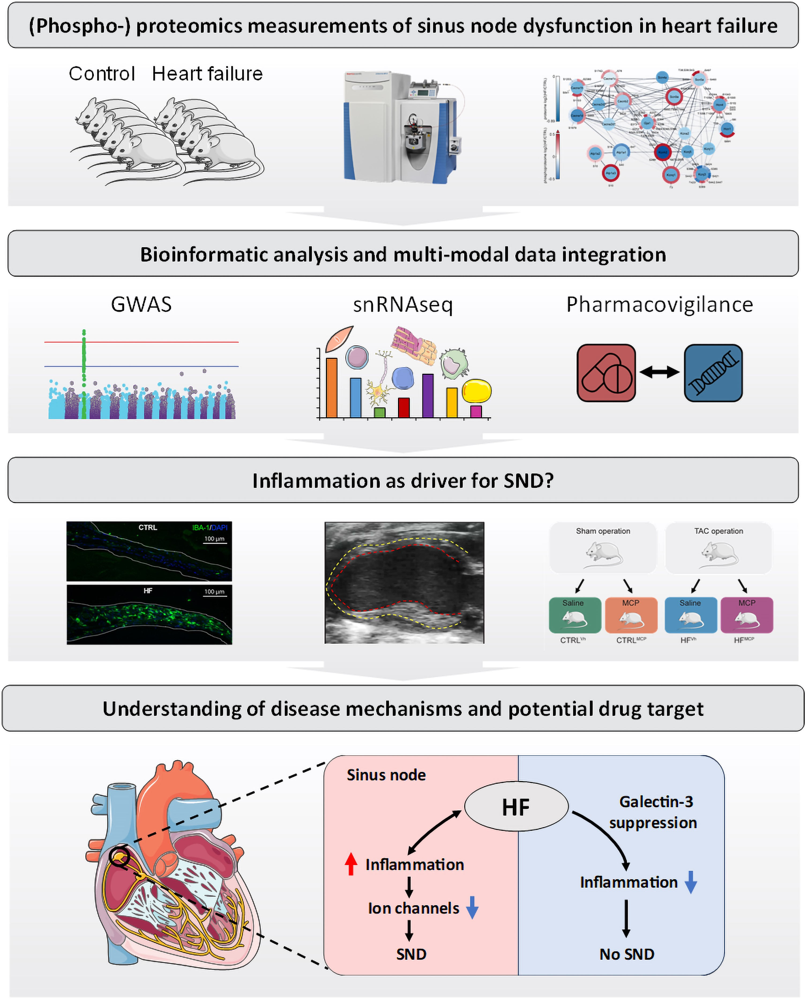

# Proteomics couples electrical remodelling to inflammation in a murine model of heart failure with sinus node dysfunction
  
This repository contains the code for the analyses conducted in the paper **Proteomics couples electrical remodelling to inflammation in a murine model of heart failure with sinus node dysfunction**, Kahnert et al., Cardiovascular Research, 2024.

Link to publication (open access):  https://doi.org/10.1093/cvr/cvae054

# Abstract
### Aims

In patients with heart failure (HF), concomitant sinus node dysfunction (SND) is an important predictor of mortality, yet its molecular underpinnings are poorly understood. Using proteomics, this study aimed to dissect the protein and phosphorylation remodelling within the sinus node in an animal model of HF with concurrent SND.

### Methods and results

We acquired deep sinus node proteomes and phosphoproteomes in mice with heart failure and SND and report extensive remodelling. Intersecting the measured (phospho)proteome changes with human genomics pharmacovigilance data, highlighted downregulated proteins involved in electrical activity such as the pacemaker ion channel, Hcn4. We confirmed the importance of ion channel downregulation for sinus node physiology using computer modelling. Guided by the proteomics data, we hypothesized that an inflammatory response may drive the electrophysiological remodeling underlying SND in heart failure. In support of this, experimentally induced inflammation downregulated Hcn4 and slowed pacemaking in the isolated sinus node. From the proteomics data we identified proinflammatory cytokine-like protein galectin-3 as a potential target to mitigate the effect. Indeed, in vivo suppression of galectin-3 in the animal model of heart failure prevented SND.

### Conclusion

Collectively, we outline the protein and phosphorylation remodeling of SND in heart failure, we highlight a role for inflammation in electrophysiological remodelling of the sinus node, and we present galectin-3 signalling as a target to ameliorate SND in heart failure.

# Graphical Abstract

